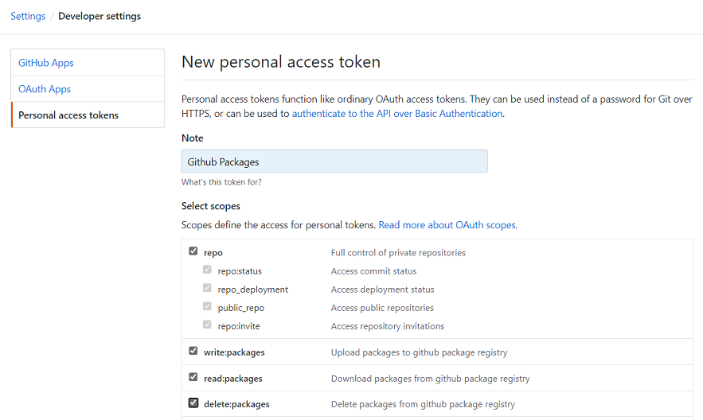

# ElGuerre.Items.Api
Is a SAMPLE ASP.NET Core API Rest to show and use it as a template to create new API Rest Proyects.

**API project**:
- Application
    - Models. Models, ViewModels and DTOs used by Controllers and Services.
    - Services. Application Logic.
- Controllers (Think controllers)
- Domain
    - Exceptions.
    - Interfaces.
- Infrastructure
    - ActionResults
    - EntityConfigurations. EF programatically configuration.
    - Filters. ASPNet Core Filteres.
    - Http. Client to invoque other API Rests.
    - Middlewares.
    - Providers.
    - Repositories. DB repositories to use EF easyly in an isolatted layer.

**k8s folder**
Kubernetes and helm ".YAML" configuration to publish to Kubernetes

**azure folder**
Azure resources scripts to register App in AAD.
other scripts, like ARM (Azure Resource Manager), could be added here.

# Next steps
All those new Patterns, Tools and Platforms, will be Blog Post entries in [elGuerre.com](https://elguerre.com)

## Learning
1. DotNet Templates
2. API REST using NetCore and best practices:
    - [Serilog](https://serilog.net/) and also 'ApplicationInsight' + Serilog Extensions.
    - [Swagger](https://docs.microsoft.com/es-es/aspnet/core/tutorials/getting-started-with-swashbuckle?view=aspnetcore-2.2&tabs=visual-studio)
    - Entity Framework Core for Commands.    
    - [Automapper](https://automapper.org/). Optional to map Model/entities.
    - HelthCheck.
    - Authenticaction (vía AAD).
3. Use Docker
4. Use Kubernetes and Helm
3. ... 

# Runnng the App
1. Using Kestrel from Visual Studio:
`
xxx
`
2. Using Docker from Visual Studio or Docker Command Line:
`
xxx
`
3. Run Entity Framework Migration: 
```
cd ElGuerre.Items.Api
dotnet ef migrations add Init --startup-project ..\src\ElGuerre.Items.Api.csproj
dotnet ef database update --startup-project ..\src\ElGuerre.Items.Api.csproj
``` 

# Generate and publish Template

## Package a new template version
- `Nuget.exe pack ElGuerre.Items.API.nuspec -Version 1.0.n`

## Github (Packages)

### Update Nuget.config
- Update ```%APPDATA%\NuGet\NuGet.config``` and delete properties "github".
- Set or updated Nuget.config properties with the password already got in the previous steps
- `nuget.exe sources Add -Name github -Source https://nuget.pkg.github.com/juanluelguerre/index.json -username ### USERNAME ### -password ### TOKEN ###`

**Note** TOKEN will be generated as follow. More details [here](https://help.github.com/en/github/managing-packages-with-github-packages/about-github-packages#about-tokens).



### PUblish a new template version
```
dotnet nuget push "ElGuerre.Items.API.1.0.0.nupkg" --source "github"
```
### Publish a new template version
- `dotnet nuget push --source github ElGuerre.Items.API.1.0.n.nupkg`
or
- `nuget.exe push -Source github ElGuerre.Items.API.1.0.n.nupkg`

## Azure DevOps (Artifacts)

### Generate a new token
- %USERPROFILE%\.nuget\plugins\netfx\CredentialProvider.Microsoft\CredentialProvider.Microsoft.exe -U https://pkgs.dev.azure.com/JuanluElGuerre/elGuerre/_packaging/templates/nuget/v3/index.json

### Update Nuget.config
- Update ```%APPDATA%\NuGet\NuGet.config``` and delete properties "templates".
- Set or updated Nuget.config properties with the password already got in the previous steps
- `nuget.exe sources Add -Name templates -Source https://pkgs.dev.azure.com/JuanluElGuerre/elGuerre/_packaging/Templates/nuget/v3/index.json -username unused -password ### TOKEN ###`

### Publish a new template version
- nuget.exe push -source templates -ApiKey AzureDevOps ElGuerre.Items.API.1.0.n.nupkg

## Install and uninstall templates

Clear cache: ```dotnet nuget locals http-cache --clear```
Add new templates ```dotnet new -i ElGuerre.Items.API::*```

**Note:** List of templeates cached: ```dotnet nuget locals all --list```
**Note:** Remove cached of templatess Http and Temps: ```dotnet nuget locals http-cache --clear``` y ```dotnet nuget locals temp --clear```
